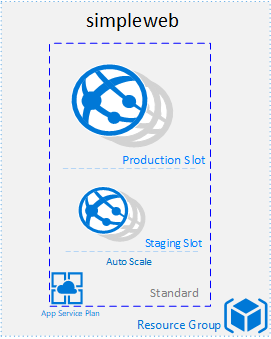

# Web Auth Template

The `webauth` sample runs a single public Linux Container within an Azure Application Service Plan which connects to CosmosDB and uses settings from the Key Vault. This template however protects the application with a service principal and an AD applictaion.


## Provisioned Resources

This deployment creates the following:

 1. Azure Resource Group
 2. Linux App Service Plan
 3. App Service and Container with a public IP.
 4. App Service Staging Slot
 5. Keyvault
 6. Service Principal
 7. AD Application




## Example Usage

1. Execute the following command to configure your local Azure CLI.

```bash
# This logs your local Azure CLI.
az login --service-principal -u $ARM_CLIENT_ID -p $ARM_CLIENT_SECRET --tenant $ARM_TENANT_ID
```

2. Execute the following commands to set up your terraform workspace.

```bash
# This configures terraform to leverage a remote backend that will help you and your
# team keep consistent state
terraform init

# This command configures terraform to use a workspace unique to you. This allows you to work
# without stepping over your teammate's deployments
terraform workspace new $USER || terraform workspace select $USER
```

3. Execute the following commands to provision resources.

```bash
# See what terraform will try to deploy without actually deploying
terraform plan

# Execute a deployment
terraform apply
```

4. Execute the following command to teardown your deployment and delete your resources.

```bash
# Destroy resources and tear down deployment. Only do this if you want to destroy your deployment.
terraform destroy
```

#### Required Variables

 1. `name`: An identifier used to construct the names of all resources in this sample.
 2. `location`: The deployment location of resource group container for all your Azure resources.
 3. `docker_registry_server_url`: The docker registry where images reside.
 3. `deployment_targets`: The name key value pair where the key is representative to the app service name and value is the source container.


## Testing

Tests are manual integration tests using the Rest Client extension for VSCode.
